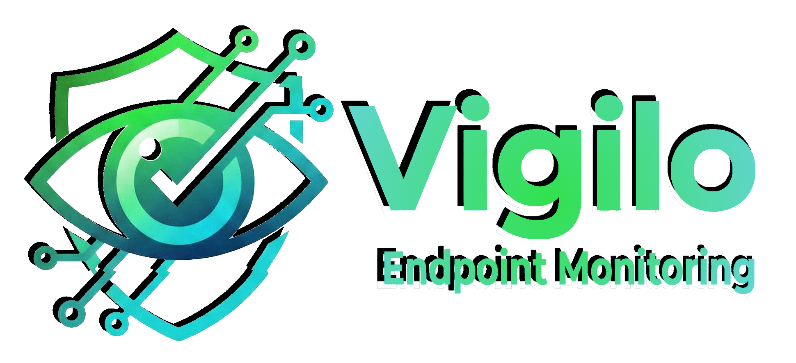
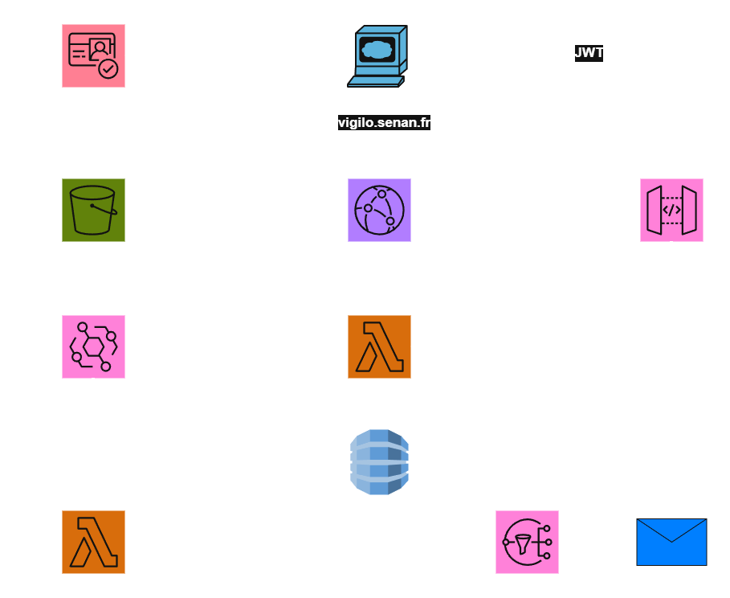
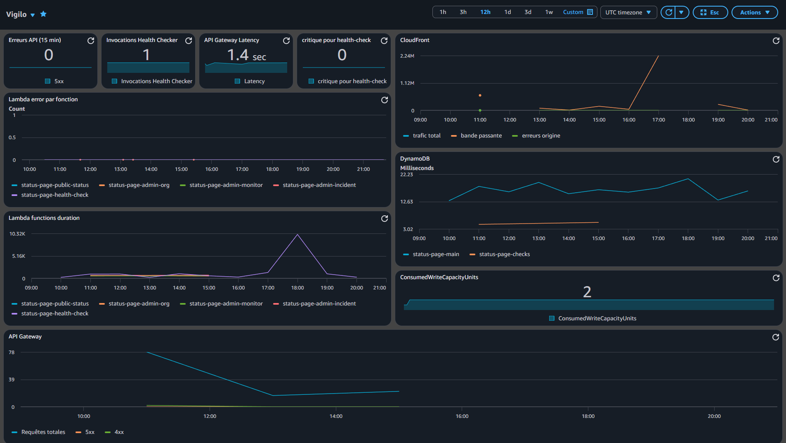

<div align="center">
  

  Multi-tenant Status Page SaaS — built entirely on AWS Serverless

  
  
  
  
  

  **[🌐 Live Demo → vigilo.senan.fr](https://vigilo.senan.fr)**
</div>

---

## Overview

**Vigilo** is a production-grade, multi-tenant status page SaaS. Organizations sign up, add HTTPS monitors, manage incidents, and instantly get a public status page at `vigilo.senan.fr/status/{slug}`. A scheduled Lambda pings every monitor every 5 minutes and sends SNS email alerts when status changes are detected.

Portfolio project demonstrating end-to-end AWS serverless architecture — from infrastructure-as-code to CI/CD to a polished React frontend.

---

## Architecture



The architecture separates three planes:

- **Frontend plane** — Next.js static export served by CloudFront from S3
- **API plane** — API Gateway HTTP API → Lambda functions → DynamoDB
- **Background plane** — EventBridge scheduler triggers the HealthCheckRunner every 5 minutes

---

## Features

- **Multi-tenant** — complete data isolation per organization via JWT-scoped `tenantId`
- **Public status page** — shareable URL at `/status/{slug}`, no login required
- **Automated health checks** — every monitor pinged every 5 minutes via EventBridge
- **Incident management** — create incidents with severity levels and timestamped updates
- **Email notifications** — per-tenant SNS topics send alerts to subscribers on status changes
- **Dashboard** — manage monitors, incidents, and org settings from a responsive React UI
- **3-step onboarding** — signup → email confirmation → interactive tutorial
- **CI/CD** — zero-credential GitHub Actions via OIDC, 3 automated workflows

---

## Tech Stack

| Layer | Technology |
| --- | --- |
| **Frontend** | Next.js 14 (App Router, static export), React 18, Tailwind CSS, TypeScript |
| **Auth (client)** | `amazon-cognito-identity-js` — direct Cognito, no Amplify |
| **Backend** | Node.js 22.x Lambda functions, TypeScript, ARM_64 |
| **Infrastructure** | CloudFormation YAML (3 stacks) |
| **Database** | DynamoDB — single-table design + time-series checks table |
| **API** | API Gateway HTTP API with Cognito JWT authorizer |
| **Notifications** | SNS (per-tenant topics, email subscriptions) |
| **Scheduler** | EventBridge `rate(5 minutes)` |
| **CDN** | CloudFront + S3 OAC (Origin Access Control) |
| **CI/CD** | GitHub Actions with OIDC (no stored AWS credentials) |

---

## AWS Services

| Service | Role |
| --- | --- |
| **CloudFormation** | Infrastructure as Code — 3 stacks deployed sequentially |
| **CloudFront** | CDN serving the static frontend, HTTPS enforcement, 1-year immutable cache for hashed assets |
| **S3** | Private bucket for the static Next.js export, accessed only via CloudFront OAC |
| **Cognito** | User pool with email verification and an immutable `custom:tenantId` attribute set post-confirmation |
| **API Gateway (HTTP API)** | Single API entry point, Cognito JWT authorizer validates ID tokens at zero added cost |
| **Lambda** | 6 functions (ARM_64, Node.js 22.x) handling all business logic |
| **EventBridge** | Cron scheduler triggering the health check runner every 5 minutes |
| **DynamoDB** | Two tables: single-table main store + time-series health checks with 30-day TTL |
| **SNS** | Per-tenant topics created at runtime for status change email notifications |
| **ACM** | TLS certificate in `us-east-1` for the CloudFront custom domain |
| **CloudWatch** | Structured logs and metrics for all Lambda functions |

---

## How It Works

1. **Signup** — the user registers and confirms their email. A post-confirmation Lambda fires and assigns an immutable UUID `tenantId` to the Cognito user.
2. **Create Org** — the user creates an organization with a unique slug. A per-tenant SNS topic is created atomically via DynamoDB `TransactWrite`.
3. **Add Monitors** — the user adds HTTPS endpoints to monitor (URL, method, expected status code, timeout).
4. **Health Checks** — every 5 minutes, EventBridge triggers the `HealthCheckRunner` Lambda. It queries all enabled monitors across all tenants via a DynamoDB GSI, pings each endpoint in parallel (max 10 concurrent), writes results with a 30-day TTL, and publishes SNS alerts on status changes.
5. **Public Status Page** — anyone can visit `/status/{slug}` to see real-time monitor statuses, uptime percentages, and active incidents — no authentication required.
6. **Incidents** — authenticated users create incidents with severity and timestamped updates. SNS notifies subscribers on each status change.

---

## CloudFormation Stacks

| Stack | File | Resources |
| --- | --- | --- |
| **DataStack** | `cloudformation/data-stack.yaml` | DynamoDB tables, Cognito User Pool, post-confirmation Lambda |
| **ApiStack** | `cloudformation/api-stack.yaml` | 5 Lambda functions, API Gateway HTTP API, EventBridge Scheduler |
| **FrontendStack** | `cloudformation/frontend-stack.yaml` | S3 bucket, CloudFront distribution, cache policies, SPA routing function |

---

## Lambda Functions

| Function | Trigger | Key Behavior |
| --- | --- | --- |
| `cognito-post-confirmation` | Cognito confirmation trigger | Generates UUID `tenantId`, sets immutable `custom:tenantId` on user. Must complete in < 5s. |
| `admin-org` | API Gateway (JWT) | Creates org + slug uniqueness lock atomically via `TransactWrite`. Creates per-tenant SNS topic at runtime. |
| `admin-monitor` | API Gateway (JWT) | Full CRUD on monitors. `enabled` stored as string `'true'`/`'false'` for GSI SK compatibility. Returns check history and uptime stats. |
| `admin-incident` | API Gateway (JWT) | Full CRUD on incidents + update feed. Uses `TransactWrite` for incident + first update atomicity. Publishes SNS on status change. |
| `health-check-runner` | EventBridge `rate(5 min)` | Queries all enabled monitors via GSI. Runs HTTP checks with `Promise.allSettled` + concurrency limiter (max 10). Updates statuses. `reservedConcurrentExecutions: 1`. |
| `public-status` | API Gateway (no auth) | Resolves slug → tenantId. Returns monitors, uptime (last 90 checks), and active incidents. `Cache-Control: 60s`. |

---

## DynamoDB Schema

### Main table: `status-page-main` (single-table design)

| Entity | PK | SK |
| --- | --- | --- |
| Org / Tenant | `ORG#{tenantId}` | `METADATA` |
| Monitor | `ORG#{tenantId}` | `MONITOR#{monitorId}` |
| Incident | `ORG#{tenantId}` | `INCIDENT#{incidentId}` |
| Incident update | `INCIDENT#{incidentId}` | `UPDATE#{timestamp}#{id}` |
| Slug lookup | `SLUG#{slug}` | `METADATA` |

**GSIs:**

- `SlugIndex` (PK=`slug`) — resolves slug → tenantId for public status pages
- `EnabledMonitorsIndex` (PK=`entityType`, SK=`enabled`) — HealthCheckRunner lists all enabled monitors across all tenants without a scan

### Checks table: `status-page-checks` (time-series)

| Item | PK | SK |
| --- | --- | --- |
| Check result | `MONITOR#{monitorId}` | `CHECK#{timestamp}` |

**GSI:** `MonitorTimeIndex` (PK=`monitorId`, SK=`checkedAt`) — time-ordered queries per monitor

**TTL:** 30 days automatic cleanup

---

## Multi-Tenancy & Security

Every admin API call extracts `tenantId` **exclusively from the Cognito JWT** (`custom:tenantId` claim) — never from the request body or path parameters. This is the security invariant enforced in `backend/src/shared/auth/extract-tenant.ts`.

All DynamoDB reads and writes are scoped to the tenant's partition key. Mismatches between the JWT claim and a stored item's `tenantId` return `403 Forbidden`. The `custom:tenantId` attribute is set once at account creation and cannot be changed.

API Gateway validates JWT signatures natively against the Cognito User Pool — no custom Lambda authorizer, zero added cost, zero added latency.

---

## CI/CD

Three GitHub Actions workflows using **OIDC** — no AWS credentials stored in secrets.

| Workflow | Trigger | Steps |
| --- | --- | --- |
| `pr-checks.yml` | Pull request to `main` | Backend typecheck + Jest tests + CloudFormation validate |
| `deploy-infra.yml` | Push to `main` touching `cloudformation/**` or `backend/**` | Build Lambda ZIP → upload to S3 → DataStack → ApiStack → FrontendStack |
| `deploy-frontend.yml` | Push to `main` touching `frontend/**` | Read CloudFormation outputs → build Next.js → S3 sync → CloudFront invalidation |

One-time OIDC setup (run once, store output as GitHub secret `AWS_ROLE_ARN`):

```bash
aws cloudformation deploy \
  --template-file cloudformation/github-oidc.yaml \
  --stack-name GithubOidcStack \
  --capabilities CAPABILITY_NAMED_IAM \
  --parameter-overrides GitHubRepo=USER/REPO
```

---

## Local Development

**Prerequisites:** Node.js 22+, AWS CLI configured

### Backend

```bash
cd backend
npm ci
npm test                                    # Run all Jest tests
npm test -- --testPathPattern checker       # Run a single test file
npx tsc --noEmit                           # Type-check without building
npm run build                              # Compile to dist/
```

### Frontend

```bash
cd frontend
npm ci
cp .env.local.example .env.local           # fill in your values
npm run dev                                # Local dev server on :3000
npm run build                              # Static export to out/
npm run type-check                         # tsc --noEmit
```

---

## Deployment

### Prerequisites
1. S3 bucket for Lambda code: `vigilo-lambda-code-{accountId}`
2. ACM certificate in `us-east-1` for your custom domain
3. GitHub OIDC role with permissions to CloudFormation, Lambda, S3, CloudFront, Cognito, DynamoDB

### Stack deploy order

```bash
aws cloudformation deploy --template-file cloudformation/data-stack.yaml --stack-name DataStack --capabilities CAPABILITY_NAMED_IAM
aws cloudformation deploy --template-file cloudformation/api-stack.yaml --stack-name ApiStack --capabilities CAPABILITY_NAMED_IAM
aws cloudformation deploy --template-file cloudformation/frontend-stack.yaml --stack-name FrontendStack --capabilities CAPABILITY_NAMED_IAM
```

### Frontend deploy to S3

```bash
# After: cd frontend && npm run build

# 1. Hashed assets — 1-year immutable cache
aws s3 sync out/_next/static s3://{bucket}/_next/static --cache-control "public, max-age=31536000, immutable" --delete

# 2. HTML and other files — no cache
aws s3 sync out s3://{bucket} --exclude "_next/static/*" --cache-control "public, max-age=0, must-revalidate" --delete

# 3. Invalidate CloudFront cache
aws cloudfront create-invalidation --distribution-id {distributionId} --paths "/*"
```

---

## Monitoring

Lambda functions emit structured logs to **CloudWatch Logs**. Metrics (invocations, errors, duration, throttles) are available per function in CloudWatch Metrics.



---

## Key Advantages

**Multi-tenancy**
Complete data isolation per organization enforced at the DynamoDB partition key level and validated on every request via an immutable Cognito JWT claim. No shared state between tenants.

**High Availability (HA)**
All components are fully managed and regionally redundant: Lambda (multi-AZ by default), DynamoDB (replicated across 3 AZs in `eu-west-3`), CloudFront (global edge network), API Gateway (managed with built-in redundancy). No single point of failure.

**Disaster Recovery (DR)**
DynamoDB tables have point-in-time recovery (PITR) enabled. S3 bucket is versioned. The entire infrastructure is reproducible from CloudFormation YAML at any time.

**Cost efficiency**
100% pay-per-use. Zero cost at zero traffic. Priced on Lambda invocations, DynamoDB on-demand reads/writes, and CloudFront data transfer.

---

## Project Structure

```text
.
├── cloudformation/       # CloudFormation YAML templates (3 stacks)
│   ├── data-stack.yaml   # DynamoDB + Cognito + post-confirmation Lambda
│   ├── api-stack.yaml    # Lambda functions + API Gateway + EventBridge
│   └── frontend-stack.yaml # S3 + CloudFront + SPA routing function
├── backend/              # Lambda functions (TypeScript, Node.js 22)
│   └── src/
│       ├── handlers/     # 6 Lambda handlers
│       └── shared/       # Auth, DB client, types, validation
├── frontend/             # Next.js 14 App Router (static export)
│   └── src/
│       ├── app/          # Pages: landing, login, register, dashboard, status
│       └── lib/          # API client, Cognito auth, i18n
└── .github/
    └── workflows/        # pr-checks, deploy-infra, deploy-frontend
```

---

If this project was useful or interesting, don't forget to leave a ⭐
